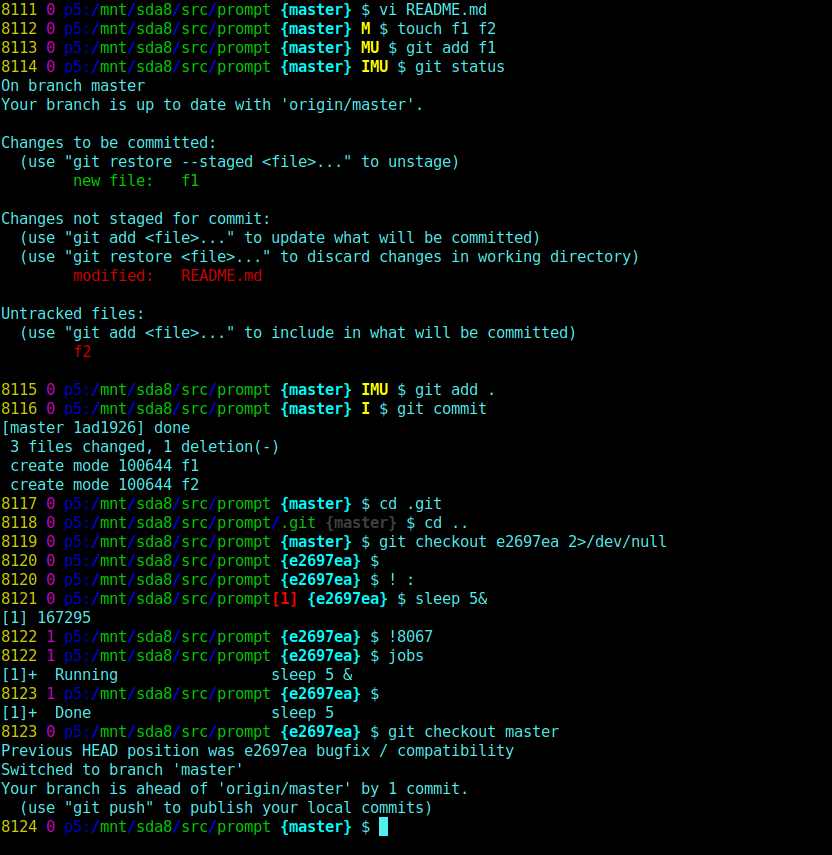

# prompt
I want my *bash prompt* to include:
 - **history** number (apply with !number)
 - number of background **jobs**
 - **host**name
 - working **dir**ectory
 - **exit** status of last command (only if != 0: "Rule of Silence")
 - git **head** (only if in git tree)
 - git **dirty** status (I:index M:modified U:untracked)
 - effective **UID**

\
**bash** prompt with _exit status_ and _git head_

---
\
flaw and **fix** for bg-jobs

---
 - New: *locale* independent

 - a version with *ansi*

 - a version with *tput*

